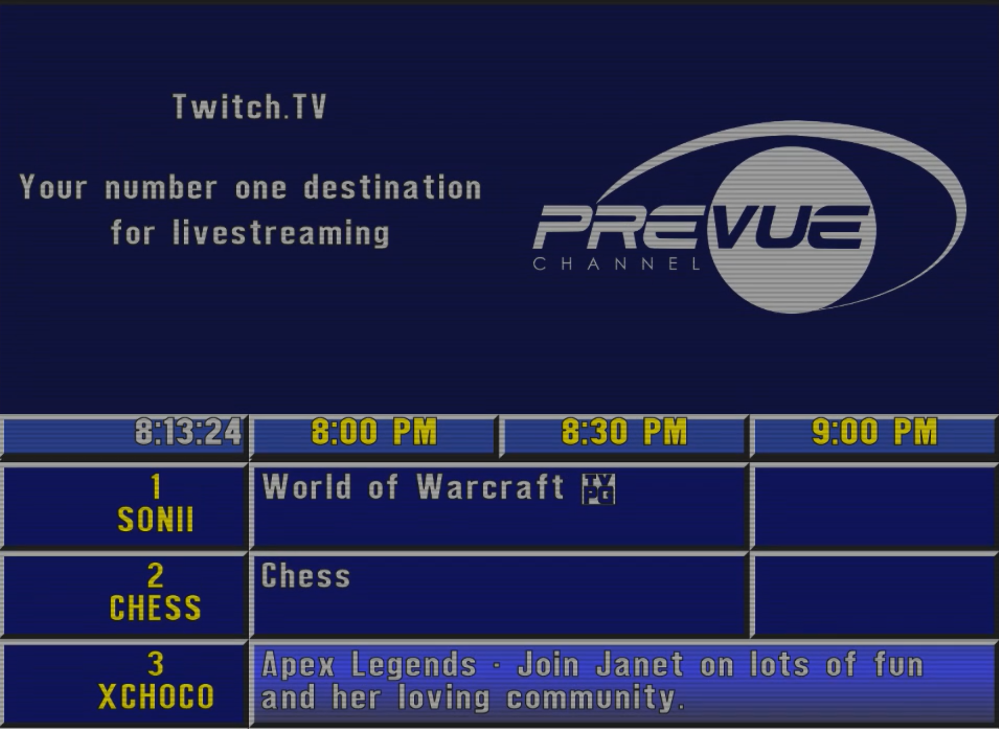

# Twitchvue Guide
### [View it live on Twitch](https://www.twitch.tv/prevueguide)

This is a simulation of a 1990s era Prevue Guide, a popular Electronic Program Guide found on many cable systems across North America. Many examples of it can be found [on Youtube](https://youtu.be/YyG_ogytL74?t=52). I don't imagine anyone will use this to actually find streams to watch, but I think it's a fun bit of nostolgia and look at what could've been.

Most of the code is forked from zshall's [TV Simulator '99](https://github.com/zshall/program-guide). Without them, this project would've never happened, so you have my deep gratitude.

If you want to run this, clone the repository, and replace "\*\*\*REMOVED\*\*\*" in js/core/tv.js with your Twitch Client ID. Right now it only works in Chrome, and has some very questionable code since this was my first major Javascript project. The livestream is generated using OBS and [obs-linuxbrowser](https://github.com/bazukas/obs-linuxbrowser).
